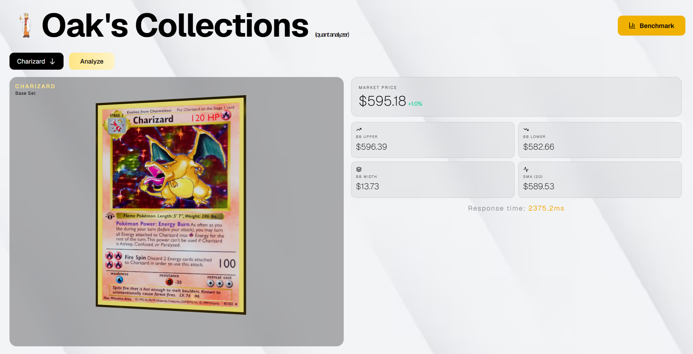

# **Pokemon Card Quant Engine**

> A C++17 backend that scrapes Pokemon TCG card prices, runs technical
> indicators over them, and serves the results to a web frontend through
> JSON files used as a cache.

Built as a learning project for low-latency C++ patterns: **lock-free
metrics**, **SIMD-accelerated math**, and **concurrent pool design** —
with measured benchmarks for each.




---

## Architecture

**Hot path** — `scraper → statsmodel → metrics`. Every step is
allocation-free and lock-free where it can be. The scraper pools curl
handles, the stats model uses AVX2+FMA intrinsics, the metrics ring
buffer publishes via a single `fetch_add` and a release-store.

**Cold path** — `metrics → JSON file → frontend`. The binary writes
its results to disk (`metrics.json`, `benchmark.json`, or stdout from
`main`). The frontend reads these files instead of calling the binary
on every request. The JSON is effectively a cached snapshot — cheap to
read, no re-scrape or re-compute per page load.

**Tests and benchmarks** sit alongside the live components, exercising
the ring buffer's invariants and comparing pool designs head-to-head.

---

## Files

| File                          | Role            | What it does                                                  |
| ----------------------------- | --------------- | ------------------------------------------------------------- |
| `main.cpp`                    | entry           | Scrape one card, run indicators, print JSON to stdout         |
| `scraper.cpp` / `.h`          | I/O             | Parallel HTTPS fetches with pooled curl handles               |
| `statsmodel.cpp` / `.h`       | compute         | Technical indicators, AVX2+FMA accelerated                    |
| `metrics.h`                   | observability   | Lock-free, allocation-free metrics ring buffer                |
| `metrics_benchmark.cpp`       | benchmark       | Google Benchmark harness in `metrics.json`, `benchmark.json`   |
| `test_metrics_concurrent.cpp` | test            | Invariant-based concurrency test for the ring buffer          |
| `bench_pool_comparison.cpp`   | benchmark       | Mutex pool vs Treiber-stack pool, fast and slow workloads     |

---

## Design notes

### `metrics.h` — lock-free hot path

Producers reserve a slot with one `fetch_add` and publish via a
release-store on a `committed` flag. No allocations, no mutex on the
write path. Aggregation is **deferred to read time** — `compute_stats`
walks the ring once and pays the O(N) cost on demand. The intent:
writes stay cheap and uniform-cost so the metrics overhead doesn't
pollute the thing being measured.

`clear()` is documented as not concurrent-safe with producers — a
deliberate tradeoff in favor of a simpler hot path.

### `scraper.cpp` — failure modes in the type system

`get_best_price` returns `std::optional<double>`. Callers can
distinguish "no data" from a real price without magic sentinel values.
Curl handles are pooled and reused via `curl_easy_reset`, which
preserves DNS, connection, and SSL session caches across requests.

### `statsmodel.cpp` — SIMD where it actually helps

SMA, variance, and Bollinger band calculations use AVX2+FMA intrinsics
with a scalar tail loop for the non-multiple-of-4 remainder. RSI is
left scalar — its loop has a data dependency that doesn't vectorize
cleanly. The MACD signal line is a known simplification (see source
comment).

### `bench_pool_comparison.cpp` — mutex vs lock-free

Compares a `std::mutex`-guarded pool against a Treiber-stack pool under
two workloads: fast (~50ns) and slow (~2ms simulating a network call).
The takeaway is the usual one: lock-free wins when work-per-acquire is
tiny and contention is high; mutex is fine (and simpler) for anything
heavier.

---

## Building

Requires **C++17**, **libcurl**, **nlohmann/json**, and **Google
Benchmark**. AVX2+FMA-capable CPU for the SIMD paths.

```bash
g++ -std=c++17 -O3 -march=native \
    main.cpp scraper.cpp statsmodel.cpp \
    -lcurl -pthread -o quant_engine
```

## Running

```bash
./quant_engine Charizard         
./test_metrics_concurrent       
./bench_pool_comparison           
./metrics_benchmark Charizard     
```

---

## Known simplifications

- **MACD signal line** uses a constant-scale approximation instead of
  the conventional 9-period EMA. Requires a historical price store the
  project doesn't currently maintain.
- **`MetricsCollector::clear()`** is not safe to call concurrently with
  producers. Documented in source. Acceptable for current usage (only
  called between test runs).